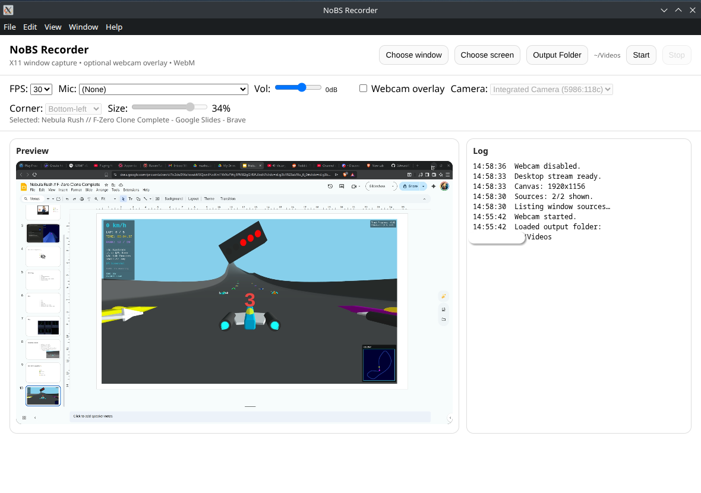

# NoBS Recorder

A minimal, reliable desktop screen recorder for Linux (X11). 

Built with Electron to ensure rock-solid window capturing without the complexity of OBS.



## Features

*   **Window & Screen Capture**: Pick any open window or full screen to record.
*   **Microphone Support**: Record audio from any input device.
    *   **Volume Boost**: Adjustable gain slider (-30dB to +20dB) for quiet microphones.
*   **Webcam Overlay**: Optional Picture-in-Picture webcam view:
    *   **Auto-start**: Remembers your last used camera.
    *   **Customizable**: Adjust corner position and size.
*   **Auto-Save**: Set a default output folder to save recordings instantly without dialogs.
*   **Visual Feedback**: Red blinking recording indicator and on-screen timer.
*   **X11 Optimized**: Uses `desktopCapturer` for reliable window enumeration on Linux.
*   **WebM Output**: Saves natively to highly compatible `.webm` files.
*   **Privacy First**: Runs entirely locally. No cloud uploads.

## Prerequisites

*   **OS**: Linux (X11). *Wayland support is currently experimental/not targeted.*
*   **Node.js**: v14+ and `npm`.

## Installation

```bash
# Clone the repository
git clone https://github.com/your-username/nobs-recorder.git
cd nobs-recorder

# Install dependencies
npm install
```

## Usage

To start the application:

```bash
npm start
```

*Note: If you encounter sandbox issues on Linux, the start script includes `--no-sandbox` to resolve common permissions errors.*

### How to Record

1.  **Choose Source**: Click "Choose window" or "Choose screen" to select what you want to capture.
    *   *Note: The recorder app itself is hidden from the window list to prevent infinite mirroring.*
2.  **Setup Audio**:
    *   Select your **Microphone** from the dropdown.
    *   Adjust **Volume** if needed (default is 0dB).
3.  **Setup Webcam (Optional)**: Toggle "Webcam overlay" to add your face cam.
4.  **Set Output Folder (Optional)**: Click "Output Folder" to choose where files save automatically.
5.  **Record**: 
    *   Click **Start**.
    *   Watch the red timer to confirm recording is active.
    *   Click **Stop** when finished.
6.  **Save**: The file will auto-save to your selected folder, or prompt for download if none is set.

## Known Limitations

*   **System Audio**: The app records microphone input only, not system/desktop audio (speakers).
*   **X11 Only**: Window selection features are optimized for X11 server environments.
*   **WebM Format**: Recordings are saved exclusively in WebM format.

## Development

*   `main.js`: Electron main process (window management, file saving IPC).
*   `renderer/renderer.js`: UI logic, stream acquisition, and canvas compositing.
*   `docs/`: Design specifications and plans.

## License

ISC
