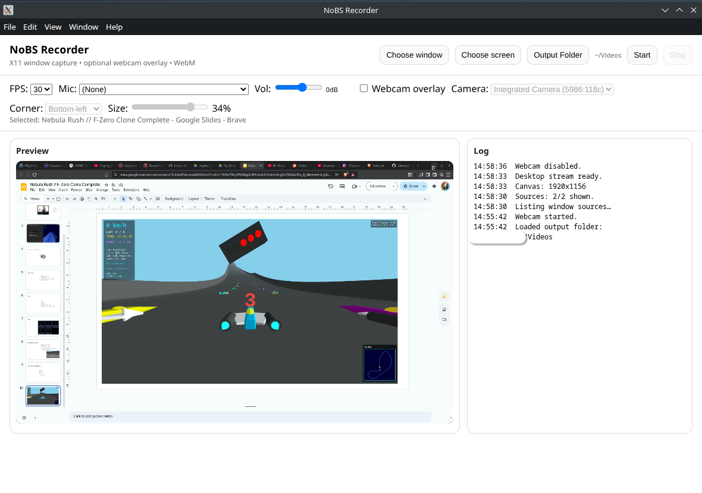

# NoBS Recorder

A minimal, reliable desktop screen recorder for Linux (X11) and Windows.

Built with Electron to ensure rock-solid window capturing without the complexity of OBS.



## Features

*   **Window & Screen Capture**: Pick any open window or full screen to record.
*   **Microphone Support**: Record audio from any input device.
    *   **Volume Boost**: Adjustable gain slider (-30dB to +40dB) for quiet microphones.
        Windows inputs are often much quieter than the same mic on Linux. Above 0dB the
        signal passes through a limiter so the extra gain does not clip; at or below 0dB
        it is bypassed entirely and the audio is untouched.
    *   **Silence Guard**: Starting with no microphone selected and no system audio asks
        for confirmation first, rather than quietly producing a mute recording.
*   **Webcam Overlay**: Optional Picture-in-Picture webcam view:
    *   **Auto-start**: Opens the webcam on launch while the overlay is ticked.
        The chosen camera is kept for the session but is not yet saved between runs.
    *   **Customizable**: Adjust corner position and size.
*   **Device Hot-plug**: Camera and microphone lists refresh when hardware is plugged
    in or removed, keeping your current selection whenever it still exists.
*   **Auto-Save**: Recordings are written straight to disk, no dialog. The default is
    the platform's own videos folder, resolved via Electron's `app.getPath("videos")`
    -- your XDG videos directory on Linux, `C:\Users\<you>\Videos` on Windows -- and
    **Output Folder** overrides it. **Reset** returns to the default.
*   **System Audio**: On platforms that expose a loopback device (Windows), desktop
    audio is mixed in alongside the mic. The toggle greys itself out where it is
    unavailable, so you always know what is being captured.
*   **Visual Feedback**: Red blinking recording indicator and on-screen timer.
*   **Reliable Enumeration**: Uses `desktopCapturer` for window and screen listing.
*   **WebM Output**: Saves natively to highly compatible `.webm` files, remuxed on save
    so they play correctly on Windows as well as Linux.
*   **Privacy First**: Runs entirely locally. No cloud uploads.

## Prerequisites

*   **OS**: Linux (X11) or Windows 10/11. *Wayland support is currently experimental/not targeted.*
*   **Node.js**: v14+ and `npm` to run the app (Electron bundles its own Node runtime).
    Building installers additionally requires **Node.js 20+**, because electron-builder 26
    depends on ESM-only packages that older Node cannot `require()`.

### Platform differences

| | Linux (X11) | Windows 10/11 |
| --- | --- | --- |
| Window / screen capture | yes | yes |
| Microphone + webcam overlay | yes | yes |
| System (desktop) audio | not available | yes, via WASAPI loopback |
| Chromium sandbox | disabled automatically | left enabled |
| Default save folder | XDG videos dir (`~/Videos`) | `C:\Users\<you>\Videos` |

`settings.json` stores an absolute path, so a settings file copied between a Linux and a
Windows machine will name a folder that does not exist on the other. The app detects
this, falls back to the local default and says so in the log, rather than creating a
nonsense directory like `C:\home\you\Videos`.

On Windows, loopback capture is system-wide: selecting a single window still records
*all* desktop audio. Untick **System audio** if you only want the mic.

## Installation

```bash
# Clone the repository
git clone https://github.com/your-username/nobs-recorder.git
cd nobs-recorder

# Install dependencies
npm install
```

## Usage

To start the application:

```bash
npm start
```

*Note: `main.js` disables the Chromium sandbox on Linux only, where the setuid sandbox
commonly trips over desktop permissions. Windows and macOS keep it enabled.*

### How to Record

1.  **Choose Source**: Click "Choose window" or "Choose screen" to select what you want to capture.
    *   *Note: The recorder app itself is hidden from the window list to prevent infinite mirroring.*
2.  **Setup Audio**:
    *   Select your **Microphone** from the dropdown.
    *   Adjust **Volume** if needed (default is 0dB).
3.  **Setup Webcam (Optional)**: Toggle "Webcam overlay" to add your face cam.
4.  **Set Output Folder (Optional)**: Click "Output Folder" to choose where files save automatically.
5.  **Record**: 
    *   Click **Start**.
    *   Watch the red timer to confirm recording is active.
    *   Click **Stop** when finished.
6.  **Save**: The file will auto-save to your selected folder, or prompt for download if none is set.

## Known Limitations

*   **System Audio on Linux**: Linux exposes no loopback source to Chromium, so recordings
    there are microphone-only. The toggle reports this rather than failing silently.
*   **Wayland**: Window selection is only verified against X11 and Windows.
*   **WebM Format**: Recordings are saved exclusively in WebM format.

## Building installers

Packaging uses [electron-builder](https://www.electron.build/). Build on the OS you are
targeting -- cross-building a Windows installer from Linux needs Wine, and AppImage/deb
cannot be produced from Windows at all.

```bash
npm run dist:win      # NSIS installer + portable .exe  -> dist/
npm run dist:linux    # AppImage + .deb                 -> dist/
npm run pack          # unpacked directory, for a quick smoke test
```

Replace `build-resources/icon.png` with real artwork before publishing; it is a
placeholder. Note that Windows builds are unsigned, so SmartScreen will warn on first
run until the executable is code-signed.

## Development

*   `main.js`: Electron main process (window management, file saving IPC).
*   `renderer/renderer.js`: UI logic, stream acquisition, and canvas compositing.
*   `renderer/webm-remux.js`: Rewrites the recorded container before saving.

MediaRecorder is a live muxer, so it writes every WebM cluster with an *unknown size*
marker. Players that scan for cluster IDs (ffmpeg, GStreamer, and so most things on
Linux) cope with that; Windows Media Foundation does not, and stops at the end of the
first cluster -- about one timeslice, or one second -- while still reporting the correct
duration. `webm-remux.js` works out where each cluster really ends by parsing its
children, then re-emits the file with definite sizes. It repairs already-broken files
by the same route, since it never trusts a declared cluster size.
*   `build-resources/`: Icons and other packaging assets.
*   `docs/`: Design specifications and plans.

## License

ISC
